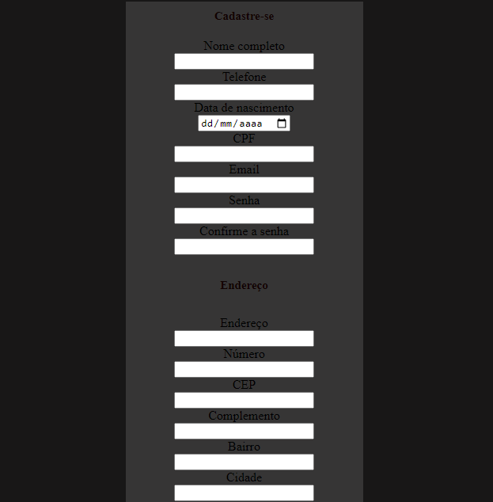

# Índice

[Descrição](#descri%C3%A7%C3%A3o)  

[Funcionalidades](#funcionalidades)  

[Tecnologia ultilizadas](#tecnologia-ultilizadas)  

[Fontes consultadas](#fontes-consultadas)

[https://github.com/](#httpsgithubcom)

[Autores](#autores)  

# 🚀 Projeto - Tela de login

## Status do Projeto🚧
> 👍Projeto Finalizado 👍

## 📋Descrição
Projeto desenvolvido para disciplina de Programação Web I. Fizemos um Formulário de cadastro para simular o cadastro de usuários para permitir acesso a um site específico

## 🔧 Funcionalidades
- `Funcionalidade 1`: Permite que o usuário coloque suas informações
- `Funcionalidade 2`: Cadastra os usuários para que acessem um sistema específico

### 🛠️ Tecnologia ultilizadas
- ``HTML``
- ``CSS``
- ``JAVASCRIPT``

## ✒️ Autores
| [ Hanelise Naves Amorim](https://github.com/hiseamorim) |  [ Leonardo Rocha](https://github.com/LeonardoRochaMarista) |  [ Marista Escola Social Ir. Acácio](https://github.com/MaristaIrAcacio) |
| :---: | :---: | :---: |
