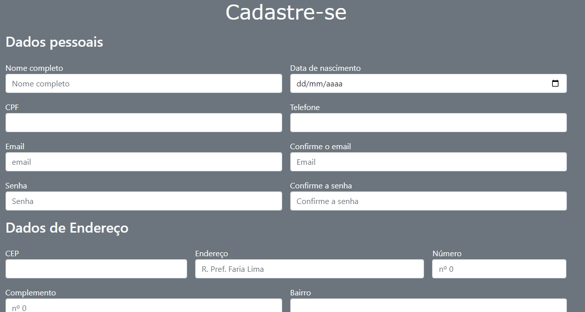

# Índice

[Descrição](#descri%C3%A7%C3%A3o)  

[Funcionalidades](#funcionalidades)  

[Tecnologia ultilizadas](#tecnologia-ultilizadas)  

[Fontes consultadas](#fontes-consultadas)

[Github](https://github.com/)

[Autores](#autores)  

# 🚀 Projeto - Tela de login
# Página antiga

# Página atualizada

## Status do Projeto🚧
> 👍Projeto Finalizado 👍

## 📋Descrição
Projeto desenvolvido para disciplina de Programação Web I. Fizemos um Formulário de cadastro para simular o cadastro de usuários para permitir acesso a um site específico.
Em atualização estamos pesquisando sites para encontrar divergências e similaridades para agregar ao nosso formulário. Acrecentamos mais campos para cadastro de endereço com base na atividade realizada anteriormente ([Clique aqui para ver](https://github.com/hiseamorim/projeto-CadEndereco)). 
Utilizamos a função para consumo de API, para invocar as ações disponíveis para requisitar informações e mandar realizar operações.

## 🔧 Funcionalidades
- `Nome Completo`: Campo para o usuário cadastrar seu nome completo.
- `Data de nascimento`: Campo para o usuário cadastrar sua data de nascimento.
- `CPF`: Campo para o usuário cadastrar seu CPF.
- `Telefone`: Campo para o usuário cadastrar seu telefone.
- `Email`: Campo para o usuário cadastrar seu email.
- `Confirmar email`: Campo para o usuário confirmar seu email.
- `Senha`: Campo para o usuário cadastrar sua senha.
- `Confirmar Senha`: Campo para o usuário confirmar sua senha.
- `CEP`: Campo para o usuário cadastrar o CEP.
- `Endereço`: Campo para o usuário cadastrar seu endereço.
- `Número`: Campo para o usúario cadastrar o número da sua residência.
- `Complemento`: Campo para o usuário adicionar o complento sobre a localização da casa.
- `Bairro`: Campo para o usuário cadastrar seu bairro.
- `Cidade`: Campo para o usuário cadastrar sua cidade.
- `Estado`: Campo para o usúario cadastrar seu estado.
- `Cadastrar`: Botão para salvar os dados inseridos nos campos.
- `Preenchimento automático`: Quando inserido o CEP os campos `Endereço` e `Bairro` são preenchidos automáticamente.
- `Verifica se o CEP é válido`: Quando inserido o CEP, ele verifica se é válido.

### 🛠️ Tecnologia ultilizadas
  | |   |   |
| :---: | :---: | :---: | :---: | 

## 📄 Fontes consultadas
- [Magalu](https://sacola.magazineluiza.com.br/#/cliente/login/?next=https%3A//www.magazineluiza.com.br/%3Fpartner_id%3D974%26gclid%3DEAIaIQobChMI8NCkoaCWggMVDl9IAB3ycQ7eEAAYASAAEgL44PD_BwE%26gclsrc%3Daw.ds&origin=magazineluiza) 
- [Shein](https://br.shein.com/user/auth/login?direction=nav)
- [Shopee](https://shopee.com.br/buyer/signup?gclid=EAIaIQobChMI-dSGrKGWggMVblRIAB1Y_gmTEAAYASAAEgKSa_D_BwE&next=https%3A%2F%2Fshopee.com.br%2F%3Fgclid%3DEAIaIQobChMI-dSGrKGWggMVblRIAB1Y_gmTEAAYASAAEgKSa_D_BwE)

## ✒️ Autores
| [ Hanelise Naves Amorim](https://github.com/hiseamorim) |  [ Leonardo Rocha](https://github.com/LeonardoRochaMarista) |  [ Marista Escola Social Ir. Acácio](https://github.com/MaristaIrAcacio) |
| :---: | :---: | :---: |
